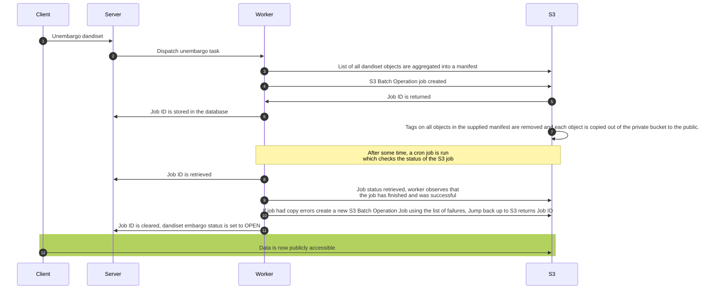

# Design private and embargoed data into a private bucket.  

A diagram of the unembargo procedure (pertaining to just the objects) is shown below

```mermaid
sequenceDiagram
    autonumber
    participant Client
    participant Server
    participant Worker
    participant S3

    Client ->> Server: Unembargo dandiset
    Server ->> Worker: Dispatch unembargo task
    Worker ->> S3: List of all dandiset objects are aggregated into a manifest
    Worker ->> S3: S3 Batch Operation job created
    S3 ->> Worker: Job ID is returned
    Worker ->> Server: Job ID is stored in the database
    S3 ->> S3: Tags on all objects in the supplied manifest are removed and each object is copied out of the private bucket to the public.
    Note over Worker,S3: After some time, a cron job is run <br> which checks the status of the S3 job
		Worker ->> Server: Job ID is retrieved
    Worker ->> S3: Job status retrieved, worker observes that <br> the job has finished and was successful
    Worker ->> S3: If job had copy errors create a new S3 Batch Operation Job using the list of failures, Jump back up to S3 returns Job ID

    Worker ->> Server: Job ID is cleared, dandiset embargo status is set to OPEN

    rect rgb(179, 209, 95)
        Client ->> S3: Data is now publicly accessible
    end
```